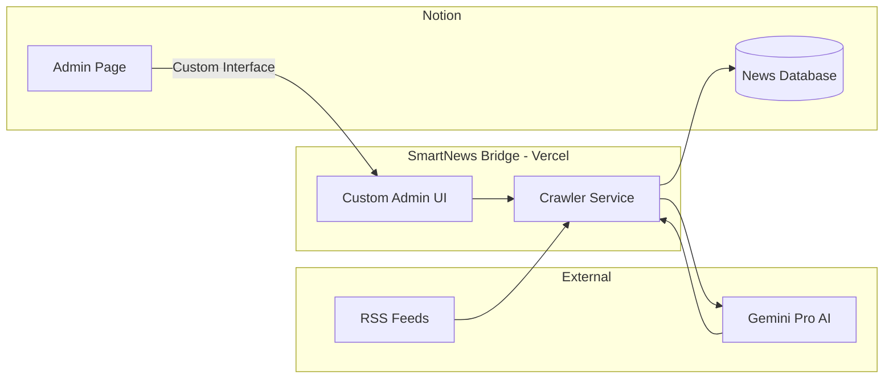
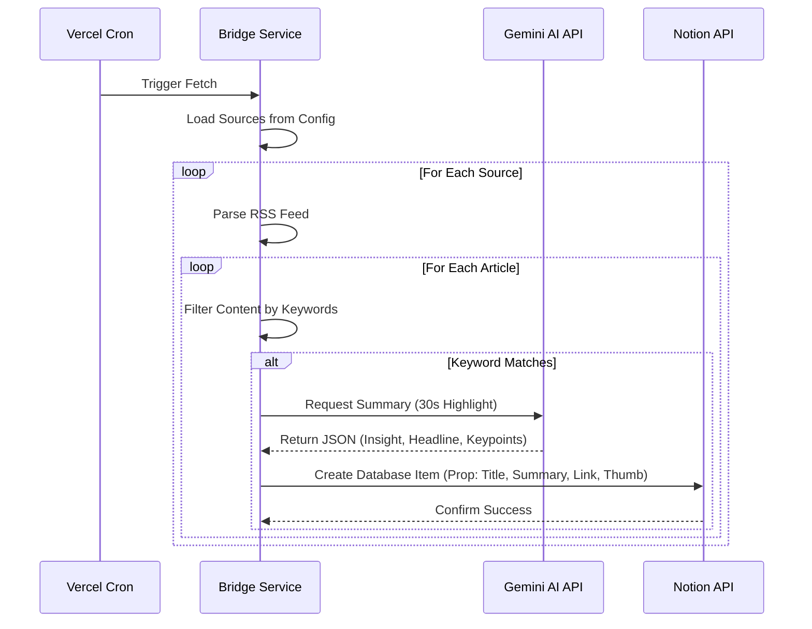
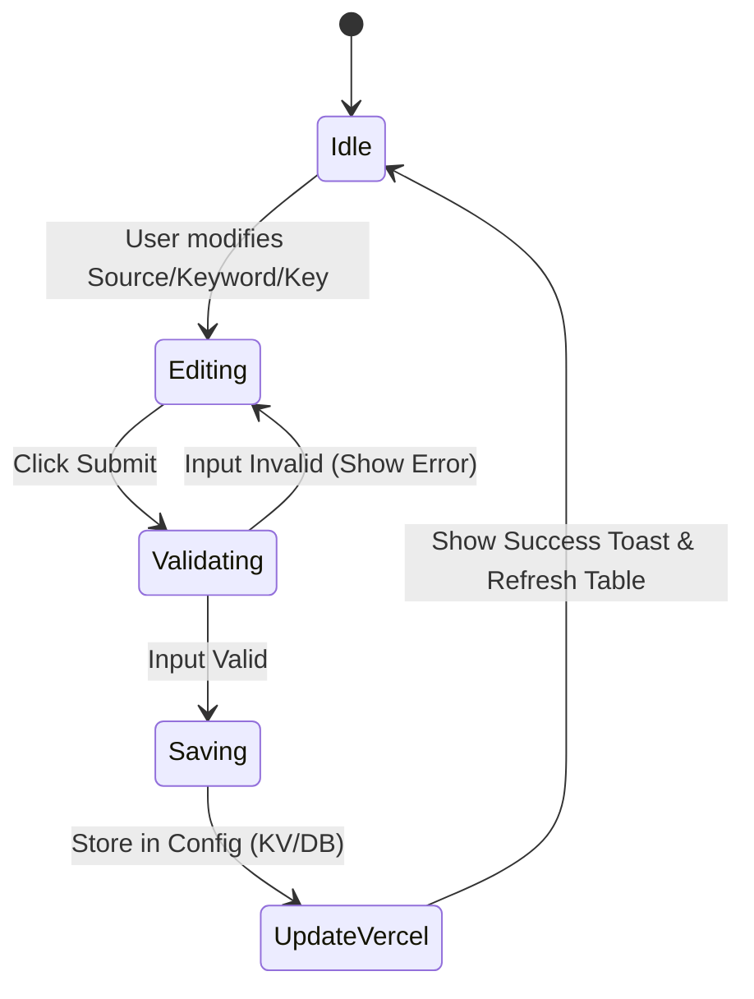

# PRODUCT REQUIREMENTS DOCUMENT (PRD)
## Project: SmartNews Bridge for Notion (Automated News Aggregator)

**Version:** 1.0  
**Status:** DRAFT  
**BA Mindset Statement:** This PRD acts as the architectural blueprint for a premium, automated information pipeline. It bridges global news (via RSS) with personal knowledge (Notion) using state-of-the-art AI (Gemini Pro) and serverless scaling (Vercel).

---

## 1. PROJECT OVERVIEW & GOALS

### 1.1 Business Objective
Enable users to capture, analyze, and synthesize global news insights within their Notion workspace in under 30 seconds. The system removes the friction of manual curation and information overload.

### 1.2 Target Audience
*   **Persona:** Individual Professional / Knowledge Worker (Personal Knowledge Base user).
*   **Need:** High-quality, filtered news summaries available directly where they work.

### 1.3 Key Success Metrics (KPIs)
*   **Efficiency:** Average time for the user to grasp an article's core value (Target: < 30 seconds).
*   **Automation:** Percentage of news pipeline handled without manual intervention (Target: 100%).
*   **Relevance:** Accuracy of keyword-based filtering (Success Rate > 90%).

---

## 2. SCOPE, ASSUMPTIONS & CONSTRAINTS

### 2.1 Scope
*   **In-Scope:**
    *   Multi-source RSS Feed Crawling.
    *   Keyword-based filtering logic.
    *   AI Summarization using Gemini Pro API.
    *   Direct syncing to a Notion News Database.
    *   Custom Admin Interface embedded in Notion (Vercel-hosted).
    *   Configurable fetch intervals.
*   **Out-of-Scope:**
    *   Deep web scraping of non-RSS sites.
    *   Multi-user/Team permission management in Phase 1.
    *   Mobile app development (Notion's own app provides the mobile interface).

### 2.2 Assumptions
*   User has a valid Notion API Integration token.
*   User has a designated Notion Database for news and a Page for the Admin UI.
*   RSS feeds provided are valid and accessible by Vercel serverless functions.

### 2.3 Constraints
*   **Cost:** Prioritize free-tier services (Vercel Hobby, Gemini Pro Free Tier, Notion API).
*   **Technical:** Vercel serverless function timeout limits (10s on Hobby tier) require efficient crawling or chunked processing.

---

## 3. SYSTEM ARCHITECTURE & PROCESS FLOWS

### 3.1 System Context Diagram
The "Smart Bridge" acts as the central orchestrator.

### 3.2 Sequence Diagram (Crawling Flow)
How a single piece of news travels from the web to Notion.

### 3.3 Activity Diagram (Admin Control Flow)
Process for updating system configuration via the embedded UI.

### 3.4 Use Case Description
| Use Case ID | Name | Actor | Precondition | Main Flow | Postcondition |
| :--- | :--- | :--- | :--- | :--- | :--- |
| **UC-01** | Add News Source | Admin | Logged into Notion | 1. Open Admin Block 2. Enter RSS URL 3. Click Submit | Source added to sync list |
| **UC-02** | Browse Summary | User | News in DB | 1. View Gallery 2. Read 30s summary 3. Click thumbnail for source | Article read or skipped |
| **UC-03** | Update AI Key | Admin | New Key avail | 1. Paste Key in Admin 2. Click Update | AI service uses new key |

---

## 4. USER STORIES (GOLDEN STANDARD)

### US-001: [ADMIN] Configure News Sources
**Priority:** High | **Story Points:** 5  
**As an** Admin  
**I want to** add, edit, and delete RSS feed URLs in a tabular interface  
**So that** I can manage my information stream without technical knowledge.

**Context & Business Rationale:**
The quality of insights depends on the input. A clean UI for source management prevents configuration errors.

**Acceptance Criteria (BDD):**
*   **Scenario 1: Add New Valid Source**
    *   **Given** the Admin UI is open in Notion
    *   **When** I enter "TechCrunch" and "https://techcrunch.com/feed/" and click "Save"
    *   **Then** the source should be immediately visible in the data table.
*   **Scenario 2: Validation of Invalid URL (Validation Error)**
    *   **Given** I enter "invalid-url" in the RSS field
    *   **When** I click "Save"
    *   **Then** the input field should highlight red and show "Please enter a valid RSS URL."

---

### US-002: [TRANSFORM] AI-Powered 30s Synthesis
**Priority:** High | **Story Points:** 8  
**As a** User  
**I want** the AI to extract exactly 3 key bullet points that summarize an article  
**So that** I can understand the impact of the news in under 30 seconds.

**Acceptance Criteria (BDD):**
*   **Scenario 1: Standard Article Processing**
    *   **Given** an article about "AI Regulation"
    *   **When** the system sends it to Gemini Pro
    *   **Then** the resulting Notion page should contain exactly 3 concise bullet points under a "Key Insights" header.
*   **Scenario 2: Content Too Short (Edge Case)**
    *   **Given** an article with very little text
    *   **When** the AI cannot find 3 points
    *   **Then** it should provide a 1-sentence "Summary" instead of empty bullet points.

---

### US-003: [ADMIN] Flexible Curation Intervals
**Priority:** Medium | **Story Points:** 3  
**As an** Admin  
**I want to** enter a specific number and select time units (Minutes / Hours) for the sync frequency  
**So that** I have granular control over how often news is updated.

**Acceptance Criteria (BDD):**
*   **Scenario 1: Set to 30 Minutes**
    *   **Given** I want more frequent updates than 1 hour
    *   **When** I enter "30" and select "Minutes" and click "Submit"
    *   **Then** the cron job should be rescheduled to run every 30 minutes.
*   **Scenario 2: Set to 12 Hours**
    *   **Given** I want to conserve API usage
    *   **When** I enter "12" and select "Hours" and click "Submit"
    *   **Then** the system should update the sync interval to twice daily.

---

### US-004: [ADMIN] Dynamic Keyword Tagging
**Priority:** High | **Story Points:** 4  
**As a** User  
**I want** to add an unlimited number of keyword tags in the "Curation" section  
**So that** I can track as many complex topics as I need simultaneously.

**Acceptance Criteria (BDD):**
*   **Scenario 1: Add Multiple Tags**
    *   **Given** I already have tags for "AI, Nvidia"
    *   **When** I type "Quantum Computing" and press Enter
    *   **Then** a new tag should be added to the list, and the system should now filter for all three topics.

---

### US-005: [ADMIN] Secure API Management
**Priority:** High | **Story Points:** 3  
**As an** Admin  
**I want to** update my Google AI Studio API key via a masked input field  
**So that** I can keep the system running without touching the source code.

**Acceptance Criteria (BDD):**
*   **Scenario 1: Update Key Successfully**
    *   **Given** a new API key is provided
    *   **When** I paste it into the "AI Service" field and click "Update"
    *   **Then** the system should attempt a test connection and show "Connected" status.

---

### US-004: [UI] Premium Gallery View in Notion
**Priority:** High | **Story Points:** 5  
**As a** User  
**I want** the news cards in Notion to display the thumbnail and a short "teaser" text  
**So that** the feed looks visually engaging and professional.

---

## 5. ADMIN INTERFACE DESIGN (UX)

**Layout Concept:** Premium "Control Center" aesthetic using Inter font, glassmorphism, and subtle emerald/gold accents.

| Section | Element | Description |
| :--- | :--- | :--- |
| **Sources** | Input + Table | Add Name/URL of RSS feeds. Delete buttons enabled. |
| **Curation** | Multi-Tag Input | Add **unlimited** tags. System filters content matching ANY tag. |
| **Schedule** | Numeric Input + Select | Enter frequency value and unit (Minutes/Hours). |
| **Security** | Password Field | Update "Google AI Studio Key" (masked by default). |
| **Action** | Primary Button | [Submit Changes] - with micro-animation on hover. |

---

## 6. NON-FUNCTIONAL REQUIREMENTS (MANDATORY)

### 6.1 Performance
*   **P-01:** System response to "Submit Changes" in Admin UI must be < 2 seconds.
*   **P-02:** Notion page creation must complete in < 3 seconds.

### 6.2 Security
*   **S-01:** API Keys must be stored as **Secret Environment Variables** in Vercel.
*   **S-02:** The Admin UI should require an "Access PIN" (default: 0000) for write operations.

### 6.3 Reliability
*   **R-01:** If an RSS feed is unreachable, the system must log the error and move to the next feed without crashing.
*   **R-02:** Handle Notion API rate limits (HTTP 429) using exponential backoff.

---

## 7. QA & DELIVERY SUPPORT

### 7.1 Acceptance Test Cases
| ID | Test Scenario | Expected Result |
| :--- | :--- | :--- |
| **T-01** | Add "TechCrunch" RSS | System pulls "TechCrunch" news on next run. |
| **T-02** | Filter by "Apple" | Only articles mentioning "Apple" appear in Notion. |
| **T-03** | Invalid API Key | Admin UI displays "Invalid API Key" warning. |

### 7.2 Definition of Done (DoD)
*   [x] PRD reviewed and approved by Stakeholder.
*   [ ] Vercel Serverless & Cron infrastructure deployed.
*   [ ] Notion Database properties verified.
*   [ ] End-to-end flow from RSS -> AI -> Notion verified.

---

**BA MINDSET STATEMENT**
This PRD follows BABOK and IEEE 830 standards to ensure a robust, testable, and high-quality implementation of the SmartNews Bridge.
